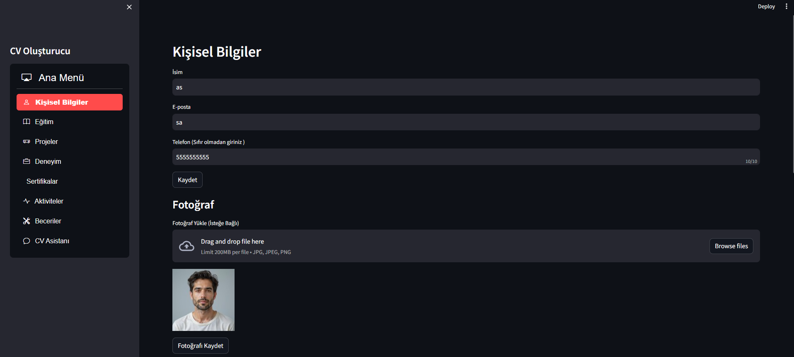

# CV Oluşturma Projesi

Bu projenin amacı, sürekli farklı iş başvuruları için sahip olduğumuz çeşitli özellikleri ve gereksinimleri ön plana çıkarma veya diğerlerini arka planda bırakma sorununu çözmektir. Proje, kullanıcıların sahip olduğu tüm yetenekleri yazabileceği, depolayabileceği ve başvuru yapacağı işin konseptine göre bu yetenekleri seçip CV'lerine eklemelerini sağlar.



## Özellikler

- **Yetenek ve Çalışma Depolama**: Kullanıcılar, sahip oldukları yetenek ve çalışmaları kaydedebilir, istedikleri zaman CV'lerine ekleyip çıkarabilirler.
- **Kaydetme Seçeneği**: Kullanıcılar, gelecekteki iş başvuruları için bilgilerini saklayabilirler.
- **Esneklik**: Örneğin, bir veri bilimci olarak görüntü işleme ağırlıklı bir şirkete başvuruyorsanız, dil işleme yeteneklerinizi kolayca çıkarabilir ve görüntü işleme ile ilgili yeteneklerinizi ekleyebilirsiniz.
- **Chatbot Desteği**: Kullanıcılar, projelerini nasıl daha etkili sunabilecekleri ve hangi çalışmalarını ön plana çıkarmaları gerektiği konusunda CV asistanı chatbot modelimizden yardım alabilirler.

## Uygulama Nasıl Çalışır?

Uygulama, aşağıdaki 7 bölümden oluşmaktadır:

1. **Kişisel Bilgiler**: Ad, e-posta, telefon numarası gibi bilgiler.
2. **Eğitim**: Okul adı, bölüm, mezuniyet tarihi gibi eğitim bilgileri.
3. **Projeler**: Tamamlanan veya üzerinde çalışılan projelerin listesi.
4. **Deneyim**: İş tecrübesi, görevler ve süre bilgileri.
5. **Sertifikalar**: Aldığınız sertifikaların listesi.
6. **Aktiviteler**: Katıldığınız etkinlikler ve rolleri.
7. **Beceriler**: Sahip olduğunuz teknik ve sosyal beceriler.

Bu bölümlerde gerekli bilgileri doldurarak CV'nizi oluşturabilir ve başvurularınız için bilgilerinizi saklayabilirsiniz. Girdiğiniz bilgiler, ilişkili veritabanında kaydedilir ve daha sonraki girişlerinizde otomatik olarak çekilir. Ayrıca, düzenleme ve silme seçenekleri ile bilgilerinizi güncelleyebilirsiniz.

Siteyi tekrar ziyaret ettiğinizde, kaydettiğiniz bilgiler otomatik olarak getirilecek ve hangi özelliklerinizin CV'de yer almasını istediğinizi belirlemek için "CV'de Göster" kutucuğunu işaretleyerek ekleyebilir veya çıkarabilirsiniz.

Tüm bu işlemler sonucunda oluşan CV'nizi Word formatında indirebilir ve son dokunuşları kendiniz yapabilirsiniz.


Ayrıca, CV hazırlama ile ilgili yardım almak istediğinizde, CV danışmanı chatbotumuz ile merak ettiklerinizi sorabilirsiniz.


## Kurulum

Projeyi çalıştırmak için aşağıdaki adımları izleyin:

1. Projeyi GitHub'dan klonlayın veya indirin.
   ```bash
   git clone https://github.com/ilyasdemir-demirilyas/Cv_Maker.git
   ```
2. Gerekli kütüphaneleri yükleyin:
   ```bash
   pip install -r requirements.txt
   ```
3. Uygulamayı başlatın:
   ```bash
   streamlit run Main.py
   ```

## Katkıda Bulunma

Katkılarınızı bekliyoruz! Projeye katkıda bulunmak için lütfen bir pull request açın veya doğrudan sorunları bildirin. Projeye yapacağınız her katkı, projenin gelişmesine yardımcı olacaktır.

## İletişim

Proje hakkında sorularınız varsa veya destek almak istiyorsanız, iletişim bilgilerinizi buraya ekleyin. Geri dönüşlerinizi bekliyoruz!
```

Mail : ilyasdemir.demirilyas@gmail.com


